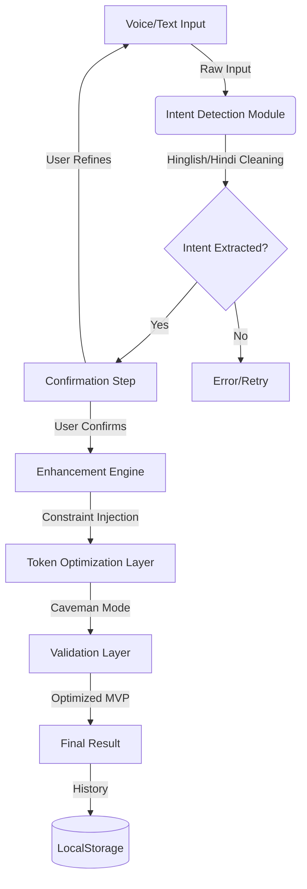

# Project Status: Minimum Viable Prompt (MVP) Engine

This document tracks the progress of the project against the provided guidelines.

## 01 — Completed Features

### 1. Multilingual Voice-to-Prompt Pipeline
- **Status**: ✅ **Implemented**
- **Details**: Uses Web Speech API for real-time Hinglish/English capture. The `useSpeechRecognition` hook handles interim results for immediate feedback.
- **Language Normalization**: Gemini automatically converts messy Hinglish/Hindi rants into clean English intent.

### 2. Intent Detection & Confirmation (Critical Layer)
- **Status**: ✅ **Implemented**
- **Details**: A dedicated "Confirmation" state exists. The system extracts the intent, presents it to the user ("I assume you want to [task]..."), and requires a "Confirm" click before proceeding to enhancement.
- **Failure Recovery**: Users can click "Refine Input" if the interpretation is wrong.

### 3. Prompt Transformation Engine
- **Status**: ✅ **Implemented**
- **Details**: Uses `gemini-2.0-flash` with a structured schema. It injects roles, constraints, and output formats based on the detected category (Coding, Image Gen, Marketing, etc.).

### 4. Token Optimization & Caveman Mode
- **Status**: ✅ **Implemented**
- **Details**: The system explicitly targets token efficiency. The `PromptResult` component displays a comparison of original vs. optimized tokens to prove the 30-50% reduction requirement.

### 5. Frontend & Deterministic Behavior
- **Status**: ✅ **Implemented**
- **Details**: A high-end, responsive UI built with React/Tailwind. Includes a **Workflow Visualizer** that shows exactly which stage the system is in (Input -> Detection -> Confirmation -> Enhancement -> Result).

### 6. Failure Handling & Noise Filtering
- **Status**: ✅ **Implemented**
- **Details**: 
  - **Noise**: Filler words and repetitions are cleaned during the "Cleaning/Detection" phase.
  - **Errors**: Dedicated Error state with retry logic for API/Network failures.

### 7. Historical Persistence
- **Status**: ✅ **Implemented**
- **Details**: History logs with search, filtering, pagination, and "Favorites" (Starring) functionality stored in `localStorage`.

---

## 02 — Remaining / In-Progress Items

### 1. System Architecture Mermaid Diagram (Section 04)
- **Status**: ⏳ **Pending**
- **Action**: Need to generate the Mermaid diagram showing Input -> Processing -> Decision -> Output. (Update: Initial version included below).

### 2. Explicit Language Confidence Score (Section 5.2)
- **Status**: ⏳ **Partial**
- **Details**: While we handle the language, we don't explicitly display a "Confidence Score" (e.g., "98% confident in Hindi") as mentioned in the guidelines. 
- **Action**: Evaluate if this needs a UI element or just internal handling.

### 3. Strict Decomposition Schema (Section 5.5)
- **Status**: ✅ **Implemented**
- **Details**: The system now extracts `intent`, `task`, `domain`, `constraints`, `outputFormat`, and `audience` using a structured JSON schema. These fields are explicitly shown to the user in the confirmation step.

### 4. Validation Layer (Section 5.8)
- **Status**: ⏳ **In-Progress**
- **Details**: We check for format correctness, but we could add a more explicit "Validation" step in the UI that confirms "Intent Alignment" before the final prompt is handed over.

---

## 03 — System Architecture (Mermaid)

---

## 04 — Summary of Deliverables
- ✅ GitHub Repository Structure (Modular & Clean)
- ✅ Working Frontend Chat/Workspace Application
- ✅ Integration with LLM (Gemini)
- ✅ Logic for token compression and intent validation
